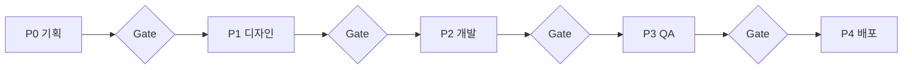

# Goodz — 풀 프로세스 운영 시스템

[](https://github.com/dayainow/goodz/actions/workflows/ci.yml)
[](https://pnpm.io/)
[](https://turbo.build/)

> **코드만 있는 쇼핑몰 데모가 아닙니다.**  
> Goodz는 **기획 → 디자인 → 개발 → QA → 배포**를 문서·게이트·모노레포·CI로 묶은 **풀 프로세스 운영 시스템**이며, 쇼핑몰은 **Goodz Commerce Reference**입니다.
> (향후 템플릿·라이선스·컨설팅 패키지로 확장 가능)

👉 **[Process Dashboard](http://localhost:5180)** — 기획·변경·산출물·승인까지 관리하는 풀 프로세스 대시보드 (`pnpm dev`)  
👉 **[North Star](./docs/00-process/NORTH_STAR.md)** — 프로젝트 존재 이유 (에이전트 필독)  
👉 **[에이전트 가이드](./docs/00-process/AGENT_GUIDE.md)** — Cursor / Claude Code 작업 절차  
👉 **[PROJECT.md](./PROJECT.md)** — 현재 Sprint · Phase 상태

👉 **[Goodz Core Onboarding](./docs/00-process/ONBOARDING.md)** — 조직 설정 후 30분 안에 첫 Gate 시작하기
👉 **[Dashboard Redesign PRD](./docs/01-planning/PRD-PROCESS-DASHBOARD-REDESIGN.md)** — Hero·Sidebar·Phase·Metrics 디자인 리셋 기준

---

## 이 프로젝트의 핵심 — 풀 프로세스 모노레포 시스템

Goodz의 **진짜 제품**은 아래입니다. 쇼핑몰 앱은 **데모**입니다.

| 시스템 레이어 | 내용 |
|---------------|------|
| **프로세스** | P0–P4, Phase Gate, Sprint ROADMAP |
| **문서 SSOT** | 기획 입력, 변경 요청, PRD, 스펙, API, ADR, QA, DACI 승인, 결정 로그, 추적 링크 |
| **운영 대시보드** | Process Dashboard에서 그룹형 메뉴, 운영 브리핑 개요, Phase, 기획, 변경, 가이드, 산출물 문서 원문, DACI 승인, 증거 누락, 시간 단위 Delivery Metrics, snapshot trend, CI 증거 추적 |
| **운영 저장소** | 문서 SSOT를 유지하면서 SQLite로 문서 인덱스·운영 사건·MTTR을 기록 |
| **모노레포** | Turborepo + pnpm, `@goodz/process` Core와 Commerce Reference 분리 |
| **품질** | `pnpm verify`, CI, GA harness 연동 패턴 |
| **AI 협업** | Phase별 스킬, Cursor / Claude Code 역할 분리 |

| 원칙 | 설명 |
|------|------|
| **Phase Gate** | P0→P4 단계마다 산출물·체크리스트를 통과해야 다음 단계로 진행 |
| **Process OS** | 기획 입력 → 변경 요청 → 산출물 레지스트리 → DACI 승인 → Commit/CI 증거 → 대시보드 추적 |
| **문서 = SSOT** | Intake·변경 로그·PRD·API·화면 스펙이 코드보다 먼저, GitHub에서 버전 관리 |
| **타입 우선 개발** | Core는 `@goodz/process`, Commerce Reference는 `@goodz/types`에서 계약 우선 |
| **검증 가능** | `pnpm verify` + CI로 매 커밋 품질 게이트 |
| **AI 역할 분리** | Phase별 스킬·에이전트(Cursor / Claude Code)로 협업 규칙 명문화 |

### 5단계 프로세스



| Phase | 핵심 산출물 |
|-------|-------------|
| P0 | 기획 입력 · 변경 로그 · PRD · 유저스토리 · GA4 명세 |
| P1 | Claude Design 12화면 · `screens/` 스펙 |
| P2 | bounded-context 타입 → API → 앱 · `pnpm verify` |
| P3 | TEST_PLAN · GA compliance · `check:process` |
| P4 | RELEASE_CHECKLIST · 배포 · DACI 승인 · CI/CD evidence |

```text
P0 기획          P1 디자인         P2 개발           P3 QA            P4 배포
────────         ────────         ────────         ────────         ────────
Intake/변경       Claude Design    context types    pnpm verify      CI green
PRD              /design-sync      api → apps       E2E 시나리오      스테이징
유저스토리        화면 프로토타입    PR + 리뷰        GA harness       프로덕션
GA4 명세         handoff→Code      ADR              회귀 테스트      승인 로그
     │                │                │                │                │
     └────────────────┴────────────────┴────────────────┴────────────────┘
                         Phase Gate — docs/00-process/PHASE_GATES.md
```

| Phase | 역할 | 핵심 산출물 | 문서 |
|-------|------|-------------|------|
| **P0 기획** | PM | 기획 입력, 변경 로그, PRD, 유저스토리, GA4 퍼널 | [intake/](./docs/01-planning/intake/) · [changes/](./docs/01-planning/changes/) · [PRD](./docs/01-planning/PRD.md) |
| **P1 디자인** | Design | Claude Design 프로토타입, DS, 화면 스펙 | [CLAUDE_DESIGN](./docs/02-design/CLAUDE_DESIGN.md) · [screens/](./docs/02-design/screens/) |
| **P2 개발** | FE/BE | API, 모노레포 코드, ADR | [ARCHITECTURE](./docs/03-engineering/ARCHITECTURE.md) · [API](./docs/03-engineering/API.md) |
| **P3 QA** | QA | 테스트 플랜, GA compliance | [TEST_PLAN](./docs/04-qa/TEST_PLAN.md) |
| **P4 배포** | DevOps | 스테이징·프로덕션 릴리스, 승인 로그 | [RELEASE_CHECKLIST](./docs/04-qa/RELEASE_CHECKLIST.md) · [APPROVALS](./docs/00-process/APPROVALS.md) |

**상세 워크플로우:** [docs/00-process/WORKFLOW.md](./docs/00-process/WORKFLOW.md)

### Sprint 타임라인 (현재)

```text
S0 ✅ 모노레포 스캐폴드   S1 ✅ MVP 쇼핑 플로우   S2 ✅ UI handoff   S3 ✅ QA·스테이징   S4 ✅ Process OS   S5 ✅ Traceability   S6 ✅ DACI   S7 ✅ Node24   S8 ✅ Trace Sync   S9 ✅ Metrics   S10 ✅ Timestamps   S11 ✅ Snapshots   S12 ✅ Docs Guide   S13 ✅ Operator UX   S14 ✅ Premium UX   S15 ✅ Design OS   S16 ✅ Premium White UI   S17 ✅ Template Onboarding   S18 ✅ White Premium Detail   S19 ✅ Sidebar Comfort   S20 ✅ SQLite Operations   S21 ✅ Platform Boundary
```

| Phase | 현재 상태 |
|-------|-----------|
| P0 기획 | 🟢 Gate 통과 |
| P1 디자인 | 🟢 12화면 완료 |
| P2 개발 | 🟢 MVP + GA4 harness + 어드민 등록 API |
| P3 QA | 🟢 smoke + staging checklist 통과 |
| P4 배포 | 🟢 release checklist + 승인 로그 준비 |
| Process OS | 🟢 기획 입력·변경·산출물·승인 대시보드 반영 |
| Traceability | 🟢 Issue/PR/Commit/CI 증거 추적 레이어 반영 |
| Approval Governance | 🟢 Driver·Approver·Contributors·Informed 승인 체계 반영 |
| CI Runtime | 🟢 GitHub Actions Node 24 + 최신 major actions 반영 |
| Evidence Automation | 🟢 GitHub trace sync + 대시보드 누락 경고 반영 |
| Delivery Metrics | 🟢 GitHub timestamp 기반 DORA 베이스라인 + snapshot trend 반영 |
| User Manual | 🟢 대시보드 가이드 메뉴 + 산출물 문서 뷰어 반영 |
| Operator UX | 🟢 그룹형 사이드바 + 행동 중심 Overview 반영 |
| Premium Dashboard UX | 🟢 검색/접힘 사이드바 + Quick jump + 콘솔형 헤더 반영 |
| Design OS | 🟢 디자인 시스템·레퍼런스·와이어프레임·스토리보드 + Design 메뉴 반영 |
| Premium White UI | 🟢 화이트 표면·미세 보더·grouped metrics·Phase flow 반영 |
| Template Onboarding | 🟢 fork 런북·template contract·standalone dependency 반영 |
| White Premium Detail | 🟢 Quick Jump·CTA·metrics·phase·metadata·typography 위계 반영 |
| Sidebar Comfort | 🟢 active disclosure·여백·fixed footer·custom scrollbar 반영 |
| SQLite Operations | 🟢 문서 인덱스·incident/MTTR·영구 디스크 배포 구성 반영 |
| Platform Boundary | 🟢 Goodz Core 모델·Commerce Reference·API 라우터 경계 반영 |

로드맵: [docs/01-planning/ROADMAP.md](./docs/01-planning/ROADMAP.md)

### 이슈 → 개발 → 배포 흐름

```text
GitHub Issue (기획/기능)
    → feature/* 브랜치
    → PR (Phase 체크리스트 + Closes #N)
    → pnpm verify (로컬) + CI (GitHub Actions)
    → merge → traceLinks 갱신 → Phase Gate 갱신
```

Traceability 운영 기준: [TRACEABILITY.md](./docs/00-process/TRACEABILITY.md) · GitHub sync: [GITHUB_TRACE_SYNC.md](./docs/00-process/GITHUB_TRACE_SYNC.md) · Metrics: [METRICS.md](./docs/00-process/METRICS.md) · 승인 기준: [APPROVALS.md](./docs/00-process/APPROVALS.md) · CI/CD 기준: [CICD.md](./docs/00-process/CICD.md)

---

## 모노레포 — Turborepo + pnpm

Goodz Core와 Goodz Commerce Reference는 같은 모노레포에서 개발하되 타입과 API 모듈 경계를 분리합니다.

```text
Goodz Core
@goodz/process → process route/data → process-dashboard

Goodz Commerce Reference
@goodz/types   → commerce route/data → web-shop/admin-dashboard

공통
@goodz/ui      → process-dashboard/web-shop/admin-dashboard
```

| 앱 | 스택 | 포트 | 역할 |
|----|------|------|------|
| **web-shop** | Next.js 15 | `:3000` | Goodz Commerce Reference B2C UX |
| **admin-dashboard** | Vite + React | `:5173` | Goodz Commerce Reference 운영 UX |
| **process-dashboard** | Vite + React | `:5180` | **기획·변경·산출물·DACI 승인·추적·Phase 관리** |
| **api-server** | Express + TS + SQLite | `:4000` | process/commerce 라우터를 조립하는 모듈형 런타임 |

| 패키지 | 역할 |
|--------|------|
| `@goodz/process` | Phase, 산출물, 승인, 추적, 지표, Incident 등 **Goodz Core SSOT** |
| `@goodz/types` | Product, Cart, Checkout 등 **Commerce Reference SSOT** |
| `@goodz/ui` | Button, Card · Tailwind preset |
| `@goodz/tsconfig` | 공유 TypeScript 설정 |

### 기능 추가 순서 (P2 규칙)

```text
① packages/process 또는 packages/types ← bounded context 타입 먼저
② apps/api-server/src/routes/{process,commerce}.ts ← 해당 API
③ packages/ui          ← 공통 UI (필요 시)
④ apps/web-shop / admin-dashboard
⑤ docs/API.md 갱신 + pnpm verify
```

### 모노레포 품질 게이트

| 검사 | 명령 | 역할 |
|------|------|------|
| 워크스페이스 일관성 | `pnpm check:workspace` | manypkg |
| 유령 의존성 | `pnpm check:deps` | depcheck |
| Process OS 정합성 | `pnpm check:process` | status.json · 산출물 · traceLinks |
| Template 계약 | `pnpm check:template` | 필수 경로 · env example · portable dependency |
| SQLite 운영 저장소 | `pnpm check:sqlite` | migration · 문서 seed · incident lifecycle · MTTR |
| GitHub 증거 동기화 | `pnpm sync:github-trace` | commit → CI/PR/Issue/Release 보강 |
| Metrics snapshot | `pnpm snapshot:metrics` | Delivery Metrics 기준점 저장 |
| 빌드 + 린트 | `turbo build && turbo lint` | Turborepo computational cache |
| **전체** | **`pnpm verify`** | PR·커밋 전 필수 |

- pnpm `node-linker=isolated` — 유령 의존성 방지
- CI: `.turbo/cache` 복원 + [ga-analytics-harness](https://github.com/dayainow/ga-analytics-harness) 형제 checkout

ADR: [001 — Turborepo + pnpm 선택](./docs/03-engineering/ADR/001-monorepo-turborepo.md) · [002 — SQLite 운영 저장소](./docs/03-engineering/ADR/002-sqlite-operations-store.md)

---

## AI 에이전트 협업

Phase마다 **다른 도구·스킬**을 쓰고, 동시 작업 시 git은 Cursor가 전담합니다.

| Phase | 도구 | 스킬 |
|-------|------|------|
| **시스템** | Cursor | `skills/goodz-system/` |
| P0 기획 | Notion, Issues | `skills/goodz-planning/` |
| P1 디자인 | Claude Design + Claude Code | `skills/goodz-design/` |
| P2 개발 | **Cursor** | `skills/goodz-dev/` |
| P3 QA | `pnpm verify`, GA harness | — |

| 도구 | 진입 문서 |
|------|-----------|
| **Cursor** | [AGENTS.md](./AGENTS.md) · `.cursor/rules/` |
| **Claude Code** | [CLAUDE.md](./CLAUDE.md) |

| 에이전트 | git |
|----------|-----|
| **Cursor** | ✅ add / commit / push 전담 |
| **Claude Code** | ❌ 파일 생성만 (디자인 산출물) |

- [AGENTS.md](./AGENTS.md) — 에이전트 규칙
- [Hermes 연동](./docs/HERMES.md) — 선택

---

## 저장소 구조

```text
goodz/
├── PROJECT.md                 # Phase · Sprint 상태 허브
├── docs/
│   ├── 00-process/            # WORKFLOW · PHASE_GATES · APPROVALS · DECISIONS · TRACEABILITY · CICD
│   ├── 01-planning/           # intake/ · changes/ · PRD · USER_STORIES · ROADMAP · GA4
│   ├── 02-design/             # CLAUDE_DESIGN · DESIGN_SYSTEM · screens/
│   ├── 03-engineering/        # ARCHITECTURE · API · ADR
│   ├── 04-qa/                 # TEST_PLAN · RELEASE_CHECKLIST
│   └── deliverables/          # 산출물 레지스트리
├── skills/                    # goodz-planning · design · dev
├── apps/                      # web-shop · admin-dashboard · process-dashboard · api-server
├── packages/                  # process(Core) · types(Commerce Reference) · ui · tsconfig
├── goodz.config.json          # 플랫폼/Reference 경계 계약
├── schemas/                   # Goodz 설정 JSON Schema
├── render.yaml                # Process OS 단일 서비스 + 영구 디스크 Blueprint
└── .github/                   # CI · 이슈/PR 템플릿
```

---

## 시작하기

```bash
git clone https://github.com/dayainow/goodz.git
cd goodz
pnpm install
pnpm build
pnpm dev          # API :4000 · Shop :3000 · Admin :5173 · Process :5180
pnpm verify       # workspace + deps + process + template + build + lint (PR 전 필수)
pnpm check:process # status.json · 산출물 · traceLinks 검증
pnpm check:template # fork 필수 경로 · 설정 · portable dependency 검증
pnpm check:sqlite  # SQLite migration · seed · incident/MTTR 검증
pnpm sync:github-trace # GitHub CI/PR/Issue/Release 증거 동기화
pnpm smoke:staging # API + 3개 화면 smoke check
pnpm smoke:process-os # 배포된 단일 Process OS health + DB + 화면 검증
```

Node.js 22.13 이상이 필요하며 배포 런타임은 Node 24를 사용합니다. 로컬 SQLite 파일은 기본적으로 `data/goodz.db`에 생성됩니다.

### 환경 변수

| 파일 | 변수 |
|------|------|
| `apps/web-shop/.env.local` | `NEXT_PUBLIC_API_URL=http://localhost:4000` |
| `apps/admin-dashboard/.env` | `VITE_API_URL=http://localhost:4000` |
| `apps/process-dashboard/.env` | `VITE_API_URL=http://localhost:4000` |
| `apps/api-server` | `GOODZ_DB_PATH=data/goodz.db`, `GOODZ_DB_DURABILITY=local` |
| 외부 Process OS | `GOODZ_BASIC_AUTH_USER`, `GOODZ_BASIC_AUTH_PASSWORD` |

스테이징 배포 절차와 smoke URL override는 [STAGING_RUNBOOK.md](./docs/04-qa/STAGING_RUNBOOK.md)를 기준으로 합니다.
새 저장소로 fork하는 절차는 [ONBOARDING.md](./docs/00-process/ONBOARDING.md)를 기준으로 합니다.

### Process OS 배포

[Render Blueprint로 배포](https://render.com/deploy?repo=https://github.com/dayainow/goodz)하면 Process Dashboard와 API가 같은 도메인에서 실행됩니다. `render.yaml`은 SQLite 보존을 위해 1GB 영구 디스크가 포함된 유료 `starter` 플랜을 사용합니다. 비용이 없는 임시 파일시스템 배포에서는 재시작 시 운영 사건이 사라질 수 있습니다.

운영 구조와 백업 기준은 [OPERATIONS_STORE.md](./docs/00-process/OPERATIONS_STORE.md)를 확인하세요.

---

## GitHub 협업

| 항목 | 설명 |
|------|------|
| **브랜치** | `main` · `develop` · `feature/*` · `design/*` · `docs/*` |
| **이슈** | 기획 / 기능 / 버그 템플릿 |
| **PR** | Phase 체크리스트 + `pnpm verify` + `Closes #이슈` |
| **CI** | [`.github/workflows/ci.yml`](./.github/workflows/ci.yml) — push·PR 시 자동 |
| **Trace** | [TRACEABILITY.md](./docs/00-process/TRACEABILITY.md) — Issue/PR/Commit/CI 증거 연결 |

---

## 기술 스택

```text
Process    Phase Gate · Process OS · Traceability · DACI Approval · Decision Log
Monorepo   Turborepo · pnpm workspaces · @goodz/process + context SSOT
Frontend   Next.js 15 · React 19 · Vite · Tailwind CSS
Backend    Express · TypeScript · node:sqlite
Quality    pnpm verify · check:process · Turbo cache · GitHub Actions Node 24 · GA harness
AI         Cursor (코드) · Claude Code (디자인) · Hermes (선택)
```

---

## 관련 프로젝트

| 프로젝트 | 연동 |
|----------|------|
| [GA Analytics Harness](https://github.com/dayainow/ga-analytics-harness) | GA4 이벤트 명세 → 코드 · MSW · compliance |
| [Claude Design](https://claude.ai/design) | P1 디자인 — [가이드](./docs/02-design/CLAUDE_DESIGN.md) |
| [Frontend Agent Orchestrator Kit](https://github.com/dayainow/frontend-agent-orchestrator-kit) | 기획/디자인 → 구현 → QA 오케스트레이션 |
| [Figma Publish Harness](https://github.com/dayainow/figma-publish) | Figma ↔ 코드 (보조) |

---

## 라이선스

[MIT](./LICENSE)
