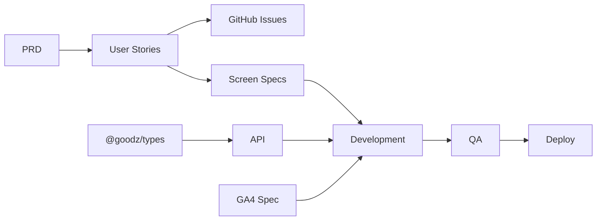

# Goodz 로드맵

> **제품 = 풀 프로세스 모노레포 시스템** · 쇼핑몰 = 레퍼런스 데모  
> [North Star](../00-process/NORTH_STAR.md) · 상태 허브: [PROJECT.md](../../PROJECT.md)

## 시스템 버전 (제품 로드맵)

| 버전 | 목표 | 상태 |
|------|------|------|
| **v0.1** | 모노레포 + P0 Gate + MVP 데모 + CI | ✅ |
| **v0.2** | P1 Claude Design + P2 UI handoff + 프로세스 대시보드 | ✅ |
| **v0.3** | Process OS: 기획 입력 + 산출물 레지스트리 + 대시보드 추적 | ✅ |
| **v0.4** | Traceability: Issue/PR/Commit/CI 증거 연결 | ✅ |
| **v0.5** | DACI Approval Governance: 승인·결정 체계 | ✅ |
| **v0.5.1** | ROADMAP 정합성 + GitHub Actions Node 24 전환 | ✅ |
| **v0.6** | GitHub Issue/PR 자동 연결 + 대시보드 누락 경고 + Release/Smoke 증거 | ✅ |
| **v1.0** | fork·판매 가능한 온보딩 패키지 (템플릿화) | ⚪ |

## 전체 타임라인

```text
S0 ✅ 스캐폴드      S1 ✅ MVP 플로우       S2 ✅ UI/대시보드      S3 ✅ QA/릴리스
S4 ✅ Process OS    S5 ✅ Traceability     S6 ✅ DACI 승인        S7 ✅ 정합성/Node24
S8 ✅ Trace Sync    S9 ⚪ Delivery Metrics
```

---

## Phase별 계획

### P0 기획 — Sprint S1 완료

| # | 작업 | 산출물 | 상태 |
|---|------|--------|------|
| P0-1 | PRD v0.1 확정 | `PRD.md` | ✅ |
| P0-2 | 유저스토리 정의 | `USER_STORIES.md` | ✅ |
| P0-3 | GA4 퍼널 초안 | `GA4_EVENTS.md` | ✅ |
| P0-4 | GitHub Issue 5건+ | Issues #1–#8 | ✅ |
| P0-5 | **P0→P1 Gate** | `PHASE_GATES.md` 체크 | ✅ |

**Gate 통과 기준:** PRD 확정 · MVP 범위 · 이슈 5+ · GA4 초안

---

### P1 디자인 — Sprint S1~S2 완료

| # | 작업 | 산출물 | 상태 |
|---|------|--------|------|
| D1-1 | 디자인 브리프 확정 | `DESIGN_BRIEF.md` | ✅ |
| D1-2 | 화면 스펙 12종 | `screens/*.md` | ✅ |
| D1-3 | DS 토큰·컴포넌트 매핑 | `DESIGN_SYSTEM.md` | ✅ |
| D1-4 | Claude Design 착수 | [CLAUDE_DESIGN.md](./CLAUDE_DESIGN.md) | ✅ |
| D1-5 | **P1→P2 Gate** | 12화면 프로토타입 + DS 매핑 | ✅ |

**병행:** 코드 스펙(`screens/`)으로 개발 착수 가능. Figma는 보조 — [FIGMA.md](../02-design/FIGMA.md).

---

### P2 개발 — Sprint S1~S7 완료

| ID | 기능 | 유저스토리 | 우선순위 | 상태 |
|----|------|-----------|----------|------|
| F-01 | 상품 목록 | US-001 | P0 | ✅ |
| F-02 | 상품 상세 | US-004 | P0 | ✅ |
| F-05 | 어드민 상품 테이블 | US-002 | P0 | ✅ |
| F-06 | Product API | — | P0 | ✅ |
| F-03 | 장바구니 | US-010 | P1 | ✅ |
| F-04 | 체크아웃 mock | US-011 | P1 | ✅ |
| F-08 | 어드민 상품 등록 | US-002+ | P1 | ✅ |
| F-09 | Search · About | — | P1 | ✅ |
| F-10 | 프로세스 대시보드 | — | P0 | ✅ |

**현재 상태:** MVP 쇼핑 플로우, 어드민, Process Dashboard, Traceability, DACI 승인 체계, 증거 자동화 완료

---

### P3 QA — Sprint S3 완료

| # | 작업 | 기준 |
|---|------|------|
| Q1 | `pnpm verify` CI green | ✅ |
| Q2 | TEST_PLAN P0 시나리오 | ✅ |
| Q3 | GA compliance | ✅ |
| Q4 | 회귀 | ✅ |

---

### P4 배포 — Sprint S3+ 완료

| # | 작업 | 기준 |
|---|------|------|
| R1 | 스테이징 배포 | ✅ 런북 + env matrix + smoke 명령 |
| R2 | RELEASE_CHECKLIST | ✅ 전 항목 완료 |
| R3 | CI/CD evidence | ✅ traceLinks + GitHub Actions |
| R4 | 프로덕션 | 외부 호스팅 연결 시 같은 smoke 절차 적용 |

---

## 스프린트 백로그 (상세)

### Sprint S1 — MVP 쇼핑 플로우

```text
Week 1
├── [P0] 이슈 등록 · Gate 문서 갱신
├── [P1] 화면 스펙 4종 (상세·장바구니·체크아웃·어드민)
└── [P2] 상품 상세 → 장바구니 → 체크아웃 mock
```

**완료 정의 (DoD):**
- `pnpm verify` pass
- 로컬 3앱 동시 기동 후 상품 클릭 → 담기 → 결제 완료까지 수동 테스트
- USER_STORIES AC 체크
- API.md 동기화

### Sprint S2 — Claude Design P1 + 어드민

- Claude Design `/design-sync` + 4화면 프로토타입
- handoff → web-shop UI polish
- 어드민 상품 등록 mock API

### Sprint S3 — QA·배포

- E2E (Playwright 선택)
- 스테이징 런북 + smoke 명령
- RELEASE_CHECKLIST 완료

### Sprint S4 — Process OS

- 기획 입력함 `docs/01-planning/intake/`
- 산출물 레지스트리 `docs/deliverables/`
- `status.json`의 `intakes`, `deliverables`
- process-dashboard `기획`, `산출물` 메뉴

### Sprint S5 — Traceability + CI/CD Evidence

- `status.json`의 `traceLinks`
- process-dashboard `추적` 메뉴
- `pnpm check:process`로 산출물·추적 링크 검증
- CI/CD 운영 문서 `docs/00-process/CICD.md`

### Sprint S6 — DACI Approval Governance

- `status.json`의 DACI 승인 필드
- process-dashboard `승인` 메뉴 고도화
- `APPROVALS.md` 승인 운영 규칙
- `DECISIONS.md` 의사결정 로그

### Sprint S7 — Roadmap + CI Runtime Maintenance

- ROADMAP의 과거 상태 표현 정리
- `status.json` v0.5.1 유지보수 trace 추가
- GitHub Actions를 Node 24와 최신 major actions로 갱신
- v0.6 자동 연결 작업 전 문서·CI 기반 정리

### Sprint S8 — GitHub Trace Sync + Evidence Alerts

- `pnpm sync:github-trace`로 CI run, PR, Issue, Release 증거 동기화
- process-dashboard `증거` 메뉴에서 누락 항목 경고
- `traceLinks[].smoke`로 smoke pass 증거 기록
- CI/CD, 스테이징, 릴리즈 문서에 운영 절차 반영

---

## 의존성 그래프



---

## 다음 액션 (즉시)

1. ✅ ROADMAP 작성
2. ✅ GitHub Issues 생성 (#1–#8)
3. ✅ 상품 상세 페이지 `/products/[id]`
4. ✅ 장바구니 API + `/cart`
5. ✅ 체크아웃 mock + `/checkout`
6. ✅ S2: Claude Design P1 (#7) · 어드민 · QA
7. ✅ S4: Process OS 산출물 레지스트리
8. ✅ v0.4: Issue/PR/Commit/CI 추적 레이어
9. ✅ v0.5: DACI 승인 체계
10. ✅ v0.5.1: ROADMAP 정합성 + CI Node 24 전환
11. ✅ v0.6: GitHub Issue/PR 자동 수집 + 대시보드 누락 경고
12. ⚪ v0.7: DORA/Delivery Metrics 초안

---

## 변경 이력

| 날짜 | 변경 |
|------|------|
| 2026-07-08 | ROADMAP v1 — S1 MVP 쇼핑 플로우 착수 |
| 2026-07-10 | v0.3–v0.5 — Process OS, Traceability, DACI 승인 체계 완료 |
| 2026-07-13 | v0.5.1 — ROADMAP 정합성 및 CI Node 24 전환 |
| 2026-07-13 | v0.6 — GitHub Trace Sync, Evidence Alerts, Release/Smoke 증거 |
