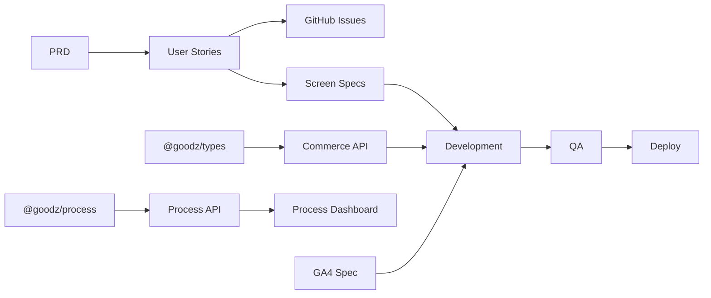

# Goodz 로드맵

> **제품 = 풀 프로세스 모노레포 시스템** · 쇼핑몰 = 레퍼런스 데모  
> [North Star](../00-process/NORTH_STAR.md) · 상태 허브: [PROJECT.md](../../PROJECT.md)

## 시스템 버전 (제품 로드맵)

| 버전 | 목표 | 상태 |
|------|------|------|
| **v0.1** | 모노레포 + P0 Gate + MVP 데모 + CI | ✅ |
| **v0.2** | P1 Claude Design + P2 UI handoff + 프로세스 대시보드 | ✅ |
| **v0.3** | Process OS: 기획 입력 + 산출물 레지스트리 + 대시보드 추적 | ✅ |
| **v0.4** | Traceability: Issue/PR/Commit/CI 증거 연결 | ✅ |
| **v0.5** | DACI Approval Governance: 승인·결정 체계 | ✅ |
| **v0.5.1** | ROADMAP 정합성 + GitHub Actions Node 24 전환 | ✅ |
| **v0.6** | GitHub Issue/PR 자동 연결 + 대시보드 누락 경고 + Release/Smoke 증거 | ✅ |
| **v0.7** | DORA/Delivery Metrics 베이스라인 + 대시보드 지표 메뉴 | ✅ |
| **v0.8** | GitHub timestamp 기반 시간 단위 Delivery Metrics | ✅ |
| **v0.9** | Metrics snapshot 저장 + 대시보드 추세 그래프 | ✅ |
| **v0.10** | 대시보드 문서 뷰어 + 서비스 이용 가이드 | ✅ |
| **v0.11** | 운영자 관점 사이드 메뉴 + Overview UX 고도화 | ✅ |
| **v0.12** | 검색/접힘 사이드바 + Quick jump + 콘솔형 헤더 UI 고급화 | ✅ |
| **v0.13** | Design OS: 레퍼런스 + 와이어프레임 + 스토리보드 + Design 메뉴 | ✅ |
| **v0.14** | Premium White UI: 화이트 표면 + grouped metrics + Phase flow | ✅ |
| **v0.15** | Template Onboarding Baseline: fork 런북 + template contract + standalone 의존성 | ✅ |
| **v0.16** | White Premium Detail: navigation + CTA + metrics + typography hierarchy | ✅ |
| **v0.17** | Sidebar Comfort: active disclosure + spacing + fixed footer + scrollbar | ✅ |
| **v0.18** | SQLite Operations: 문서 인덱스 + incident/MTTR + 영구 디스크 배포 | ✅ |
| **v0.19** | Platform Boundary: Core 모델 + Commerce Reference + API 모듈 경계 | ✅ |
| **v0.20** | Portability Proof: 비커머스 Internal Service Reference + Core 무변경 검증 | ✅ |
| **v0.21** | Writable Process MVP: Project·Run·Task·Gate command + audit | ✅ |
| **v0.22** | Process Template Catalog: Phase 0–8 + Deliverable/Evidence command + Builder | ✅ |
| **v0.23** | Visual Template Builder: clone + structured editing + live validation | ✅ |
| **v0.24** | PRD & Design Workbench: guided PRD + MVP design pack + Claude handoff | ✅ |
| **v0.25** | Design Job Connector & Export: 상태 추적 + prompt snapshot + portable bundle | ✅ |
| **v0.26** | Git Materializer & Goodz CLI: init + project create + safe export + verify | ✅ |
| **v0.27** | Existing Repository Adopt: 구조 탐지 + read-only plan + explicit apply | ✅ |
| **v0.28** | Immutable Template Migration: 새 version 생성 + 기존 Run 고정 | ✅ |
| **v0.29** | Git Connector: approved export branch + commit + push + pull request | ✅ |
| **v1.0** | 설치 가능한 Goodz Core: adopt + Template/config migration + clean-clone 도입 | ✅ |
| **v1.1** | Installable Empty Workspace: 사용자 런타임·Goodz 내부 이력·독립 DB/file scaffold 분리 | ✅ |
| **Archive** | Goodz 기능 동결·검증 기준선·후속 로컬 Project OS 이식 인계 | 🚧 |

## 전체 타임라인

```text
S0 ✅ 스캐폴드      S1 ✅ MVP 플로우       S2 ✅ UI/대시보드      S3 ✅ QA/릴리스
S4 ✅ Process OS    S5 ✅ Traceability     S6 ✅ DACI 승인        S7 ✅ 정합성/Node24
S8 ✅ Trace Sync    S9 ✅ Delivery Metrics    S10 ✅ Timestamp Metrics    S11 ✅ Metrics Snapshots    S12 ✅ Docs Guide    S13 ✅ Operator UX    S14 ✅ Premium UX    S15 ✅ Design OS    S16 ✅ Premium White UI    S17 ✅ Template Onboarding    S18 ✅ White Premium Detail    S19 ✅ Sidebar Comfort    S20 ✅ SQLite Operations
S21 ✅ Platform Boundary    S22 ✅ Portability Proof    S23 ✅ Writable Process    S24 ✅ Template Catalog    S25 ✅ Visual Builder    S26 ✅ PRD/Design Workbench    S27 ✅ Design Job/Export    S28 ✅ Git Materializer/CLI    S29 ✅ Repository Adopt    S30 ✅ Template Migration    S31 ✅ Git Connector    S32 ✅ Core v1.0 Gate    S33 ✅ UI Boundary    S34 🚧 Empty Workspace
```

---

## Phase별 계획

### P0 기획 — Sprint S1 완료

| # | 작업 | 산출물 | 상태 |
|---|------|--------|------|
| P0-1 | PRD v0.1 확정 | `PRD.md` | ✅ |
| P0-2 | 유저스토리 정의 | `USER_STORIES.md` | ✅ |
| P0-3 | GA4 퍼널 초안 | `GA4_EVENTS.md` | ✅ |
| P0-4 | GitHub Issue 5건+ | Issues #1–#8 | ✅ |
| P0-5 | **P0→P1 Gate** | `PHASE_GATES.md` 체크 | ✅ |

**Gate 통과 기준:** PRD 확정 · MVP 범위 · 이슈 5+ · GA4 초안

---

### P1 디자인 — Sprint S1~S2 완료

| # | 작업 | 산출물 | 상태 |
|---|------|--------|------|
| D1-1 | 디자인 브리프 확정 | `DESIGN_BRIEF.md` | ✅ |
| D1-2 | 화면 스펙 12종 | `screens/*.md` | ✅ |
| D1-3 | DS 토큰·컴포넌트 매핑 | `DESIGN_SYSTEM.md` | ✅ |
| D1-4 | Claude Design 착수 | [CLAUDE_DESIGN.md](./CLAUDE_DESIGN.md) | ✅ |
| D1-5 | Design OS | `DESIGN_OS.md` + references/wireframes/storyboards | ✅ |
| D1-6 | **P1→P2 Gate** | 12화면 프로토타입 + DS 매핑 | ✅ |

**병행:** 코드 스펙(`screens/`)으로 개발 착수 가능. Figma는 보조 — [FIGMA.md](../02-design/FIGMA.md).

---

### P2 개발 — Sprint S1~S7 완료

| ID | 기능 | 유저스토리 | 우선순위 | 상태 |
|----|------|-----------|----------|------|
| F-01 | 상품 목록 | US-001 | P0 | ✅ |
| F-02 | 상품 상세 | US-004 | P0 | ✅ |
| F-05 | 어드민 상품 테이블 | US-002 | P0 | ✅ |
| F-06 | Product API | — | P0 | ✅ |
| F-03 | 장바구니 | US-010 | P1 | ✅ |
| F-04 | 체크아웃 mock | US-011 | P1 | ✅ |
| F-08 | 어드민 상품 등록 | US-002+ | P1 | ✅ |
| F-09 | Search · About | — | P1 | ✅ |
| F-10 | 프로세스 대시보드 | — | P0 | ✅ |

**현재 상태:** MVP 쇼핑 플로우, 어드민, Process Dashboard, Traceability, DACI 승인 체계, 증거 자동화, 시간 단위 Delivery Metrics, snapshot trend, 문서 뷰어/이용 가이드, 운영자 UX, 프리미엄 대시보드 UX, Design OS, Premium White UI 완료

---

### P3 QA — Sprint S3 완료

| # | 작업 | 기준 |
|---|------|------|
| Q1 | `pnpm verify` CI green | ✅ |
| Q2 | TEST_PLAN P0 시나리오 | ✅ |
| Q3 | GA compliance | ✅ |
| Q4 | 회귀 | ✅ |

---

### P4 배포 — Sprint S3+ 완료

| # | 작업 | 기준 |
|---|------|------|
| R1 | 스테이징 배포 | ✅ 런북 + env matrix + smoke 명령 |
| R2 | RELEASE_CHECKLIST | ✅ 전 항목 완료 |
| R3 | CI/CD evidence | ✅ traceLinks + GitHub Actions |
| R4 | 프로덕션 | 외부 호스팅 연결 시 같은 smoke 절차 적용 |

---

## 스프린트 백로그 (상세)

### Sprint S1 — MVP 쇼핑 플로우

```text
Week 1
├── [P0] 이슈 등록 · Gate 문서 갱신
├── [P1] 화면 스펙 4종 (상세·장바구니·체크아웃·어드민)
└── [P2] 상품 상세 → 장바구니 → 체크아웃 mock
```

**완료 정의 (DoD):**
- `pnpm verify` pass
- 로컬 3앱 동시 기동 후 상품 클릭 → 담기 → 결제 완료까지 수동 테스트
- USER_STORIES AC 체크
- API.md 동기화

### Sprint S2 — Claude Design P1 + 어드민

- Claude Design `/design-sync` + 4화면 프로토타입
- handoff → web-shop UI polish
- 어드민 상품 등록 mock API

### Sprint S3 — QA·배포

- E2E (Playwright 선택)
- 스테이징 런북 + smoke 명령
- RELEASE_CHECKLIST 완료

### Sprint S4 — Process OS

- 기획 입력함 `docs/01-planning/intake/`
- 산출물 레지스트리 `docs/deliverables/`
- `status.json`의 `intakes`, `deliverables`
- process-dashboard `기획`, `산출물` 메뉴

### Sprint S5 — Traceability + CI/CD Evidence

- `status.json`의 `traceLinks`
- process-dashboard `추적` 메뉴
- `pnpm check:process`로 산출물·추적 링크 검증
- CI/CD 운영 문서 `docs/00-process/CICD.md`

### Sprint S6 — DACI Approval Governance

- `status.json`의 DACI 승인 필드
- process-dashboard `승인` 메뉴 고도화
- `APPROVALS.md` 승인 운영 규칙
- `DECISIONS.md` 의사결정 로그

### Sprint S7 — Roadmap + CI Runtime Maintenance

- ROADMAP의 과거 상태 표현 정리
- `status.json` v0.5.1 유지보수 trace 추가
- GitHub Actions를 Node 24와 최신 major actions로 갱신
- v0.6 자동 연결 작업 전 문서·CI 기반 정리

### Sprint S8 — GitHub Trace Sync + Evidence Alerts

- `pnpm sync:github-trace`로 CI run, PR, Issue, Release 증거 동기화
- process-dashboard `증거` 메뉴에서 누락 항목 경고
- `traceLinks[].smoke`로 smoke pass 증거 기록
- CI/CD, 스테이징, 릴리즈 문서에 운영 절차 반영

### Sprint S9 — Delivery Metrics Baseline

- `docs/00-process/METRICS.md` 지표 정의
- process-dashboard `지표` 메뉴
- DORA 원형 지표: 배포 빈도, 리드타임, CI 성공률, 변경 실패율, MTTR
- Goodz 보조 지표: evidence completeness, smoke pass rate, trace coverage

### Sprint S10 — Timestamp Metrics

- `sync:github-trace`가 commit/CI/PR/Issue/Release timestamp 저장
- process-dashboard `지표` 메뉴에서 요청→커밋→CI→증거 시간 표시
- 날짜-only 기록 fallback 유지
- 다음 단계의 MTTR, PR review lead time, metrics snapshot 기반 마련

### Sprint S11 — Metrics Snapshots

- `pnpm snapshot:metrics`로 Delivery Metrics 기준점 저장
- `references/goodz-internal/metrics-snapshots.json` snapshot SSOT 추가
- process-dashboard `지표` 메뉴에서 snapshot trend 그래프 표시
- 다음 단계의 incident/MTTR 기록과 PR review lead time 기반 마련

### Sprint S12 — Docs Viewer Guide

- `docs/00-process/USER_MANUAL.md` 서비스 이용 매뉴얼 추가
- API 서버 `GET /api/process/document` 읽기 전용 문서 endpoint 추가
- process-dashboard `가이드` 메뉴에서 운영 문서 확인
- process-dashboard `산출물` 메뉴에서 deliverable 원문 확인

### Sprint S13 — Operator UX

- 사이드 메뉴를 Start / Plan / Control / System 그룹으로 재구성
- 개요 화면에 Start here, Next signal, Health 액션 카드 추가
- P0-P4 Operating map을 개요에서 바로 확인
- 사용자가 다음에 볼 메뉴를 판단할 수 있게 메인 대시보드 고도화

### Sprint S14 — Premium Dashboard UX

- 사이드바에 메뉴 검색과 Quick jump 추가
- 많은 메뉴를 다루기 쉽게 그룹 접힘/펼침 상태 제공
- 현재 섹션, sprint, version, updated date를 보여주는 콘솔형 헤더 적용
- Atlassian, IBM Carbon, Material 계열 운영 콘솔 내비게이션 원칙을 PROCESS_DASHBOARD 문서에 기록

### Sprint S15 — Design OS

- `docs/02-design/DESIGN_OS.md` 디자인 운영 허브 추가
- `REFERENCES.md`에 Atlassian, Carbon, Polaris, GOV.UK 차용점 기록
- `wireframes/README.md`와 `storyboards/README.md`를 산출물로 등록
- `status.json`에 `designReferences`, `wireframes`, `storyboards` 추가
- process-dashboard `디자인` 메뉴 추가

### Sprint S16 — Premium White UI

- process-dashboard 카드 표면을 white/#FAFAFA + 미세 보더 중심으로 정리
- pastel 배경은 일반 카드 장식에서 제거하고 상태 신호에만 사용
- Overview metric을 Completion, Delivery Health, Operations 그룹으로 압축
- P0-P4 운영 맵을 선형 phase flow로 개선
- `PROCESS_DASHBOARD.md`, `DESIGN_SYSTEM.md`, `status.json`에 UI 원칙과 증거 연결

---

### Sprint S17 — Template Onboarding Baseline

- ONBOARDING.md에 30분 fork → verify → 첫 P0 Gate 런북 정의
- template.config.json으로 필수 산출물, env example, 커스터마이즈 지점 정의
- pnpm check:template로 필수 계약과 저장소 밖 file 의존성 검증
- GA analytics harness를 GitHub commit에 pin해 형제 저장소 필수 결합 제거
- v1.0 Gate는 clean-clone CI, rebrand 리허설, 배포 증거 후 통과

---

### Sprint S18 — White Premium Detail Tuning

- Quick Jump active/inactive 대비와 sidebar hover/collapse cue 강화
- Start here, Next signal, Health를 역할별 표면과 타이포로 구분
- Completion 완료 badge, Operations 자연어 signal 적용
- P2 현재 운영 강조와 metadata hierarchy 적용
- Noto Sans KR, line-height, scrollbar, near-black progress 기준 추가
- 후속 Gate: 1440px/1024px 브라우저 육안 QA

---

### Sprint S19 — Sidebar Comfort

- sidebar width 360px과 horizontal padding 20px 적용
- 활성 메뉴 그룹 자동 열기, Plan/Control/System 기본 접힘
- 그룹 외곽 카드 제거와 divider 기반 구분
- navigation scroll과 SSOT footer 영역 분리
- 8px rounded scrollbar와 stable gutter 적용
- 후속 Gate: 768px 높이 브라우저 육안 QA

---

### Sprint S20 — SQLite Operations

- Node 내장 SQLite schema migration과 문서 인덱스 seed
- incident 생성·종료와 MTTR 계산 API
- Process Dashboard 운영 DB 메뉴와 same-origin production serving
- Render 단일 서비스 Blueprint와 1GB 영구 디스크 구성
- 후속 Gate: 비용 승인 후 외부 URL과 재배포 보존 smoke 기록

---

### Sprint S21 — Platform Boundary

- 제품명은 Goodz로 유지하고 Core / Cloud / Enterprise 제품군 확정
- Goodz Commerce Reference를 공식 예제 경계로 명시
- Process OS 계약을 `@goodz/process`로 분리
- API를 process/commerce 라우터로 모듈 분리
- `goodz.config.json`, JSON Schema, ADR-003으로 기계 판독 경계 정의
- 다음 Gate: 비커머스 Reference가 Core 수정 0건으로 `pnpm verify` 통과

---

### Sprint S22 — Portability Proof

- `references/internal-service`에 비커머스 서비스 카탈로그 Reference 추가
- 자체 `@goodz/internal-service-types`와 Node API로 도메인 계약 격리
- Reference 전용 P0–P4 산출물과 manifest 작성
- `goodz.config.json`에 Core v0.1.0 SHA-256 기준선 기록
- `pnpm check:portability`로 Core 무변경·Commerce 의존 0건·산출물 완결성 검증
- 다음 Gate: `goodz init/adopt/verify` CLI와 clean-clone 도입 검증

---

### Sprint S23 — Writable Process MVP

- `@goodz/process`에 Template, Project, Run, Stage, Task, Gate, Audit 계약 추가
- SQLite schema v2와 기본 P0–P4 Template seed
- 프로젝트 생성, 단계·작업 변경, GO/HOLD/KILL command API
- Process Dashboard 프로젝트 관리 화면과 append-only 실행 이력

### Sprint S24 — Process Template Catalog

- `templates/process/*.json`에서 P0–P4와 Phase 0–8 정의를 읽는 파일 기반 Catalog
- SQLite schema v3에 Template Deliverable, Run Deliverable, Evidence 저장 모델 추가
- 필수 산출물 승인 전 GO를 거부하는 Gate guard
- 문서·Issue·PR·Commit·CI·Release 증거 제출 command
- Dashboard JSON Template Builder와 실행 가능한 Catalog UI
- `pnpm check:sqlite`에서 작업 완료 → GO → 다음 단계 시작 lifecycle 검증
- 다음 Gate: JSON 입력 없이 Template을 구성하는 Visual Builder

### Sprint S25 — Visual Template Builder

- Template 이름·설명과 Stage code/name/summary 구조화 편집
- Stage 추가·삭제·위/아래 순서 변경
- Stage별 Task와 Deliverable 추가·삭제, 필수 산출물 설정
- P0–P4·Phase 0–8·사용자 Template 복제 편집
- Stage/Task/필수 산출물 수와 저장 가능 상태를 보여주는 Live Blueprint
- Core Template Stage의 `code` 계약 노출과 API 길이·개수·중복 검증
- 다음 Gate: Template version migration과 `goodz init/adopt/verify`

### Sprint S26 — PRD & Design Workbench

- 프로젝트별 문제·사용자·가치·MVP·비목표·지표·제약 질문형 PRD Wizard
- 답변 기반 Markdown PRD preview와 승인 command
- 화면 목적·영역·주요 행동 기반 MVP 와이어프레임 명세
- Actor·Action·Screen·Outcome 스토리보드와 디자인 콘셉트
- PRD와 Design Pack을 합성한 Claude Design handoff prompt
- Claude Design 결과 URL 연결과 PRD 선행 승인 guard
- SQLite schema v4와 기존 Project Workbench backfill
- 다음 Gate: 승인 PRD Git export, Claude Connector, Template version migration

### Sprint S27 — Design Job Connector & Export

- Core `ProcessDesignJob` 계약과 SQLite schema v5
- `manual_claude_design` Connector의 생성·시작·제출·수정 요청·승인 command
- Job 생성 시 PRD와 Design Pack handoff prompt snapshot 고정
- PRD/Design 변경 시 열려 있는 Job 자동 무효화
- 승인 PRD·Design Pack·Claude handoff Markdown 3건 portable export
- 다음 Gate: Git materializer, 인증 기반 Claude MCP/API adapter, Template version migration

### Sprint S28 — Git Materializer & Goodz CLI

- publish-ready `@goodz/cli` workspace package와 `goodz` binary
- `goodz init`, `goodz project create`, `goodz export`, `goodz verify`
- `docs/projects/` Markdown 3건과 `.goodz/exports` hash manifest
- dry-run, force, 원자적 쓰기와 로컬 수정 충돌 보호
- 절대/상위 경로와 symbolic link write 차단
- CLI 단위 테스트와 실제 Process API project/export smoke
- 다음 Gate: `goodz adopt`, Template migration, 자동 Git branch/commit/PR Connector

### Sprint S29 — Existing Repository Adopt

- `package.json`, `apps/`, `packages/`, `references/` 기반 기존 모노레포 탐지
- top-level 앱과 중첩 Reference 앱·타입 패키지 후보 분리
- 기본 실행은 read-only 계획, `--apply`에서만 설정과 materialization 경계 생성
- 기존 `goodz.config.json` 보호와 명시적 `--force`
- 다음 Gate: Template/config migration과 clean-clone 검증

### Sprint S30 — Immutable Template Migration

- `POST /api/process/templates/:templateId/versions`로 다음 버전 생성
- Stage·Task·Deliverable 정의를 복제하고 원본 Template 불변 유지
- 기존 Process Run은 생성 당시 version에 고정
- `goodz template migrate` CLI와 v1/v2 실제 API smoke
- Core 0.7.0 계약 갱신
- 다음 Gate: config migration, clean-clone과 Git branch/commit/PR Connector

### Sprint S31 — Git Branch/Commit/PR Connector

- `goodz git publish`로 승인 export와 Git 전달 흐름 결합
- clean working tree와 승인 파일 allowlist 검증
- 별도 branch와 Conventional Commit 생성
- remote push와 token 기반 GitHub Pull Request API
- dry-run, local-only, push-only 운영 모드
- 임시 bare remote에서 실제 branch·commit·push smoke
- 다음 Gate: config migration, clean-clone CI와 원격 persistent deployment 검증

### Sprint S32 — Installable Goodz Core v1.0

- `goodz config migrate` v1→v2 dry-run·원자적·멱등 migration
- config v2에 export/manifest 경계와 Git 기본 정책 선언
- `pnpm check:clean-clone` offline frozen install과 핵심 계약 검증
- clean checkout에서 `@goodz/process` 선행 build 후 CLI test 보장
- `@goodz/process`와 `@goodz/cli` v1.0 publish metadata
- Portability Gate 완료, Enterprise Gate는 별도 로드맵으로 유지

---

## 의존성 그래프



---

## 다음 액션 (즉시)

1. ✅ ROADMAP 작성
2. ✅ GitHub Issues 생성 (#1–#8)
3. ✅ 상품 상세 페이지 `/products/[id]`
4. ✅ 장바구니 API + `/cart`
5. ✅ 체크아웃 mock + `/checkout`
6. ✅ S2: Claude Design P1 (#7) · 어드민 · QA
7. ✅ S4: Process OS 산출물 레지스트리
8. ✅ v0.4: Issue/PR/Commit/CI 추적 레이어
9. ✅ v0.5: DACI 승인 체계
10. ✅ v0.5.1: ROADMAP 정합성 + CI Node 24 전환
11. ✅ v0.6: GitHub Issue/PR 자동 수집 + 대시보드 누락 경고
12. ✅ v0.7: DORA/Delivery Metrics 초안
13. ✅ v0.8: GitHub timestamp 기반 시간 단위 metrics
14. ✅ v0.9: Metrics snapshot + 추세 그래프
15. ✅ v0.10: 문서 뷰어 + 서비스 이용 가이드
16. ✅ v0.11: 운영자 UX 고도화
17. ✅ v0.12: 프리미엄 대시보드 UX 고도화
18. ✅ v0.13: Design OS 산출물 체계
19. ✅ v0.14: Premium White UI 고도화
20. ✅ v0.15: Template Onboarding Baseline + standalone 의존성
21. ✅ v0.16: White Premium Detail Tuning
22. ✅ v0.17: Sidebar Comfort
23. ✅ v0.18: SQLite Operations
24. ✅ v0.19: Goodz Core / Commerce Reference 경계 추출
25. ✅ v0.20: Internal Service Reference + Core 무변경 이식성 증거
26. ✅ v0.21: Writable Process Project/Task/Gate lifecycle
27. ✅ v0.22: 파일 기반 Process Template Catalog + Deliverable/Evidence command
28. ✅ v0.23: Visual Template Builder + clone + live validation
29. ✅ v0.24: Guided PRD + MVP Design Pack + Claude Design handoff
30. ✅ v0.25: Design Job Connector + prompt snapshot + portable export
31. ✅ v0.26: Git Materializer + Goodz CLI init/project/export/verify
32. ✅ v0.27: 기존 저장소 read-only adopt plan + explicit apply
33. ✅ v0.28: immutable Template version migration + 기존 Run 고정
34. ✅ v0.29: 승인 산출물 Git branch/commit/push/PR Connector
35. ✅ v1.0 Gate: config migration + clean-clone CI
36. ✅ v1.1: 빈 Workspace scaffold + 선택적 Goodz Internal Reference 최종 QA
37. 🚧 Archive: 기능 동결 + Repository Closure Gate + 후속 제품 이식 인계
38. ↗ Guided Flow·Cloud·RBAC 후보는 자동 승계하지 않고 후속 제품에서 재검토

---

## 변경 이력

| 날짜 | 변경 |
|------|------|
| 2026-07-08 | ROADMAP v1 — S1 MVP 쇼핑 플로우 착수 |
| 2026-07-10 | v0.3–v0.5 — Process OS, Traceability, DACI 승인 체계 완료 |
| 2026-07-13 | v0.5.1 — ROADMAP 정합성 및 CI Node 24 전환 |
| 2026-07-13 | v0.6 — GitHub Trace Sync, Evidence Alerts, Release/Smoke 증거 |
| 2026-07-13 | v0.7 — Delivery Metrics 베이스라인 |
| 2026-07-13 | v0.8 — GitHub timestamp 기반 시간 단위 metrics |
| 2026-07-13 | v0.9 — Metrics snapshot 저장 + 추세 그래프 |
| 2026-07-13 | v0.10 — 대시보드 문서 뷰어 + 서비스 이용 가이드 |
| 2026-07-13 | v0.11 — 운영자 관점 사이드 메뉴 + Overview UX 고도화 |
| 2026-07-13 | v0.12 — 프리미엄 대시보드 UX 고도화 |
| 2026-07-13 | v0.13 — Design OS 산출물 체계 |
| 2026-07-13 | v0.14 — Premium White UI 고도화 |
| 2026-07-13 | v0.15 — Template Onboarding Baseline + standalone 의존성 |
| 2026-07-13 | v0.16 — White Premium Detail Tuning |
| 2026-07-13 | v0.17 — Sidebar Comfort |
| 2026-07-13 | v0.18 — SQLite Operations + persistent deployment blueprint |
| 2026-07-13 | v0.19 — Goodz Core 모델과 Commerce Reference/API 경계 분리 |
| 2026-07-14 | v0.20 — 비커머스 Internal Service Reference와 Core 무변경 이식성 검증 |
| 2026-07-14 | v0.21 — 프로젝트·작업·Gate를 관리하는 Writable Process MVP |
| 2026-07-14 | v0.22 — Phase 0–8 Template Catalog와 산출물·증거 관리 |
| 2026-07-14 | v0.23 — JSON 없는 Visual Template Builder와 복제 편집 |
| 2026-07-14 | v0.24 — 질문형 PRD와 Claude Design handoff Workbench |
| 2026-07-14 | v0.25 — Claude Design Job 상태 관리와 portable Markdown export |
| 2026-07-14 | v0.26 — 안전한 Git Materializer와 Goodz CLI 기본 명령 |
| 2026-07-14 | v0.27 — 기존 저장소 구조 탐지와 명시적 adopt 적용 |
| 2026-07-14 | v0.28 — immutable Template migration과 Run version 고정 |
| 2026-07-14 | v0.29 — 승인 산출물 Git branch/commit/push/PR Connector |
| 2026-07-14 | v1.0 — config migration·clean-clone Gate와 설치 가능한 Core/CLI |
| 2026-07-14 | v1.1 — 사용자 빈 Workspace와 Goodz 내부 개발 이력의 물리·런타임 분리 |
| 2026-07-15 | Archive — Goodz 기능 동결과 후속 로컬 Project OS 별도 저장소 분리 결정 |
