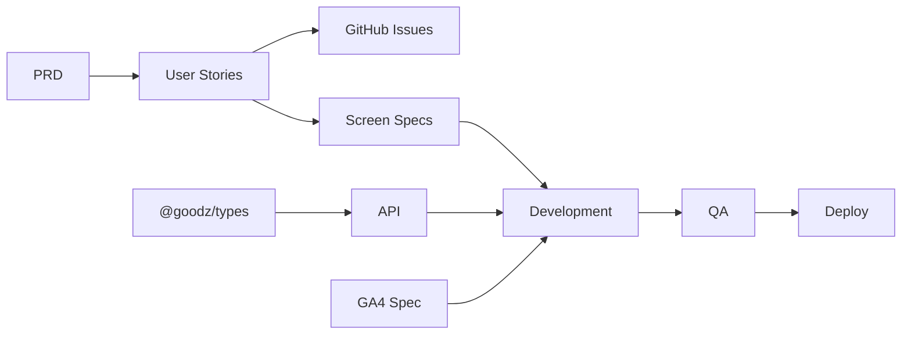

# Goodz 로드맵

> 기획 → 디자인 → 개발 → QA → 배포 단계별 실행 계획  
> 상태 허브: [PROJECT.md](../../PROJECT.md)

## 전체 타임라인

```text
S0 ✅ 스캐폴드     S1 ✅ MVP 플로우        S2 🟡 Claude Design P1     S3 ⚪ QA·스테이징
────────────      ────────────────────────────      ───────────────      ───────────────
모노레포           기획 확정 · 이슈 등록              Claude Design P1      E2E · 릴리스
3앱 기동           상품 상세 · 장바구니 · 체크아웃     /design-sync · handoff   프로덕션
```

---

## Phase별 계획

### P0 기획 — Sprint S1 (현재)

| # | 작업 | 산출물 | 상태 |
|---|------|--------|------|
| P0-1 | PRD v0.1 확정 | `PRD.md` | ✅ |
| P0-2 | 유저스토리 정의 | `USER_STORIES.md` | ✅ |
| P0-3 | GA4 퍼널 초안 | `GA4_EVENTS.md` | ✅ |
| P0-4 | GitHub Issue 5건+ | Issues #1–#8 | ✅ |
| P0-5 | **P0→P1 Gate** | `PHASE_GATES.md` 체크 | ✅ |

**Gate 통과 기준:** PRD 확정 · MVP 범위 · 이슈 5+ · GA4 초안

---

### P1 디자인 — Sprint S1~S2

| # | 작업 | 산출물 | 상태 |
|---|------|--------|------|
| D1-1 | 디자인 브리프 확정 | `DESIGN_BRIEF.md` | ✅ |
| D1-2 | 화면 스펙 5종 | `screens/*.md` | 🟡 |
| D1-3 | DS 토큰·컴포넌트 매핑 | `DESIGN_SYSTEM.md` | 🟡 |
| D1-4 | Claude Design 착수 | [CLAUDE_DESIGN.md](./CLAUDE_DESIGN.md) | 🟡 |
| D1-5 | **P1→P2 Gate** | 4화면 프로토타입 + DS 매핑 | ⚪ |

**병행:** 코드 스펙(`screens/`)으로 개발 착수 가능. Figma는 보조 — [FIGMA.md](../02-design/FIGMA.md).

---

### P2 개발 — Sprint S1~S2

| ID | 기능 | 유저스토리 | 우선순위 | 상태 |
|----|------|-----------|----------|------|
| F-01 | 상품 목록 | US-001 | P0 | ✅ |
| F-02 | 상품 상세 | US-004 | P0 | ✅ |
| F-05 | 어드민 상품 테이블 | US-002 | P0 | ✅ |
| F-06 | Product API | — | P0 | ✅ |
| F-03 | 장바구니 | US-010 | P1 | ✅ |
| F-04 | 체크아웃 mock | US-011 | P1 | ✅ |
| F-08 | 어드민 상품 등록 | US-002+ | P1 | ✅ |

**S1 목표 (이번 스프린트):** F-02 · F-03 · F-04 완료 → MVP 쇼핑 플로우 end-to-end

---

### P3 QA — Sprint S3

| # | 작업 | 기준 |
|---|------|------|
| Q1 | `pnpm verify` CI green | 100% pass |
| Q2 | TEST_PLAN P0 시나리오 | 전부 pass |
| Q3 | GA compliance | ga-analytics-harness 연동 |
| Q4 | 회귀 | 상품→장바구니→결제 플로우 |

---

### P4 배포 — Sprint S3+

| # | 작업 | 기준 |
|---|------|------|
| R1 | 스테이징 배포 | Vercel (web) + API 호스팅 |
| R2 | RELEASE_CHECKLIST | 전 항목 완료 |
| R3 | 프로덕션 | 도메인·환경변수 |

---

## 스프린트 백로그 (상세)

### Sprint S1 — MVP 쇼핑 플로우 (현재)

```text
Week 1
├── [P0] 이슈 등록 · Gate 문서 갱신
├── [P1] 화면 스펙 4종 (상세·장바구니·체크아웃·어드민)
└── [P2] 상품 상세 → 장바구니 → 체크아웃 mock
```

**완료 정의 (DoD):**
- `pnpm verify` pass
- 로컬 3앱 동시 기동 후 상품 클릭 → 담기 → 결제 완료까지 수동 테스트
- USER_STORIES AC 체크
- API.md 동기화

### Sprint S2 — Claude Design P1 + 어드민

- Claude Design `/design-sync` + 4화면 프로토타입
- handoff → web-shop UI polish
- 어드민 상품 등록 mock API

### Sprint S3 — QA·배포

- E2E (Playwright 선택)
- 스테이징 배포
- RELEASE_CHECKLIST

---

## 의존성 그래프



---

## 다음 액션 (즉시)

1. ✅ ROADMAP 작성
2. ✅ GitHub Issues 생성 (#1–#8)
3. ✅ 상품 상세 페이지 `/products/[id]`
4. ✅ 장바구니 API + `/cart`
5. ✅ 체크아웃 mock + `/checkout`
6. 🟡 S2: Claude Design P1 (#7) · 어드민 · QA

---

## 변경 이력

| 날짜 | 변경 |
|------|------|
| 2026-07-08 | ROADMAP v1 — S1 MVP 쇼핑 플로우 착수 |
